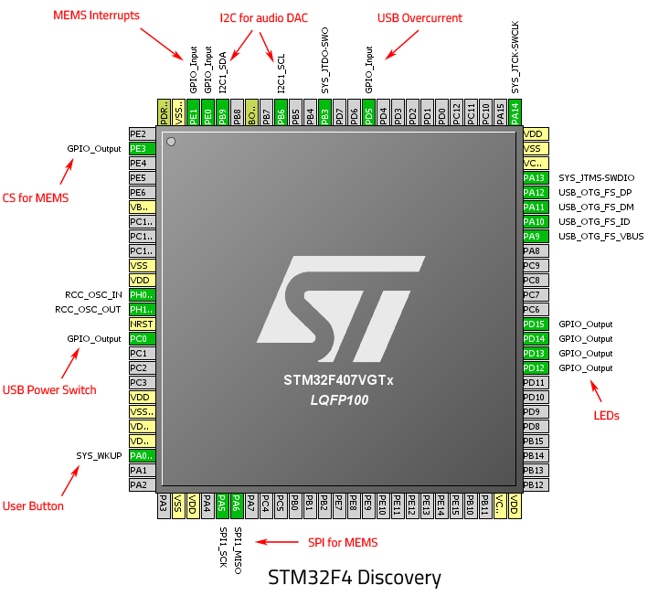

# Discovery Board Pin Usage

Not all pins can be used on the discovery board, some are already connected to
peripherals on the board.

For the purpose of this project, pins connected to the audio devices and the
MEMS accelerometer are ignored, since none of those devices will be used.
However, some of them are outputs from the devices and can't be used.

## Usable pins:

| Pin(s) | Function          | Description                                                           |
| ------ | ----------------- | --------------------------------------------------------------------- |
| PB6/9  | I2C for audio DAC | I2C1 connected to the audio DAC, can be used for other stuff (DAC address is `1001010 = 0x4A`, 4k7 pullup connected)               |
| PA0    | User Button       | The blue user button on the board (220k pulldown, active high)        |
| PD12   | Green LED         | Green LED to the left of the MEMS sensor                              |
| PD13   | Orange LED        | Orange LED above the MEMS sensor                                      |
| PD14   | Red LED           | Red LED to the right of the MEMS sensor                               |
| PD15   | Blue LED          | Blue LED below the MEMS sensor                                        |
| PH0/1  | HSE               | High speed oscillator in- and output (connected to 8MHz xtal + ST-LINK clock) |
| PC0    | USB Power Switch  | `!Enable` signal to the USB power supply chip (10k pullup connected)  |
| PD5    | USB Overcurrent   | `!Fault` signal from the USB power supply chip (47k pullup connected) |

## Useless pins (more or less):
| Pin(s) | Function       | Description                                                              |
| ------ | -------------- | ------------------------------------------------------------------------ |
| PE0/1  | MEMS Interrupt | Interrupt outputs from the MEMS sensor, are driven by the sensor         |
| PE3    | CS for MEMS    | SPI CS signal for the MEMS sensor (low for SPI mode, high for I2C)       |
| PA5/6  | SPI for MEMS   | PA7 could be MOSI for other SPI devices, but collides with RMII Ethernet |
