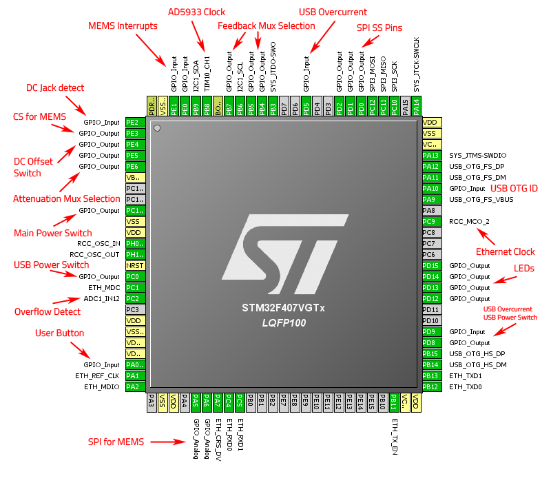

# Discovery Board Main Shield Pin Usage

This is the preliminary pin usage plan for the main shield.

Components on the main shield (most of them optional) are:

 + AD5933
 + Analog front end
 + EEPROM
 + Ethernet MAC
 + SPI Memory
 + USB A Connector

## Pin Description:

Description of the used pins, clockwise from PE1:

| Pin(s)     | Function                  | Description                                                                 |
| ---------- | ------------------------- | --------------------------------------------------------------------------- |
| PE0/1      | MEMS Interrupt            | Unused, see [DiscoveryPins](DiscoveryPins.md).                              |
| PB9        | I2C Data                  | Used for communication with AD5933 and EEPROM.                              |
| PB8        | AD5933 Clock              | Low speed clock signal for the AD5933 for low frequency measurements.       |
| PB7        | Feedback Mux Selection    | Analog mux input selection signals, feedback resistor mux.                  |
| PB6        | I2C Clock                 | Used for communication with AD5933 and EEPROM.                              |
| PB5/4      | Feedback Mux Selection    | Analog mux input selection signals, feedback resistor mux.                  |
| PB3        | SWD Trace                 | Not used on the shield.                                                     |
| PD5        | USB Overcurrent           | Unused, see [DiscoveryPins](DiscoveryPins.md).                              |
| PD2..0     | SPI SS Pins               | Pins to be used for SPI device selection.                                   |
| PC12..PC10 | SPI Interface             | Used for SPI devices: SRAM, Flash and input Mux.                            |
| PA14/13    | SWD Clock and Data        | Not used on the shield.                                                     |
| PA12..PA9  | USB Device                | Discovery USB, not used on the shield.                                      |
| PC9        | Ethernet Clock Out        | 50MHz clock output to be used by the Ethernet MAC and STM32 ETH peripheral. |
| PD15..PD12 | LEDs                      | Discovery LEDs, not used on the shield.                                     |
| PD9        | USB Overcurrent           | Overcurrent signal for the USB host port.                                   |
| PD8        | USB Power Switch          | Output power switch enable signal for the USB host port.                    |
| PB15/14    | USB Host                  | Used for the USB A (host) connector on the shield.                          |
| PB13..PB11 | Ethernet TX               | Transmit data and enable pins for the Ethernet MAC.                         |
| PC5/4      | Ethernet RX               | Receive data pins for the Ethernet MAC.                                     |
| PA7        | Ethernet CS/DV            | Carrier Sense/Data Valid pin for the Ethernet MAC.                          |
| PA6/5      | SPI for MEMS              | Unused, see [DiscoveryPins](DiscoveryPins.md).                              |
| PA2        | Ethernet MDIO             | Management data pin for the Ethernet MAC.                                   |
| PA1        | Ethernet Clock In         | Reference clock signal input for the Ethernet MAC.                          |
| PA0        | User Button               | Discovery Button, not used on the shield.                                   |
| PC2        | Overflow Detect           | ADC input to detect possible AD5933 clipping for auto-ranging.              |
| PC1        | Ethernet MDC              | Management clock pin for the Ethernet MAC.                                  |
| PC0        | USB Power Switch          | Unused, see [DiscoveryPins](DiscoveryPins.md).                              |
| PH1/0      | Main Clock                | Main clock from the ST-LINK, not used on the shield.                        |
| PC15       | Main Power Switch         | Power switch that controls all the shield peripherals.                      |
| PE6/5      | Attenuation Mux Selection | Analog mux input selection signals, attenuation mux.                        |
| PE4        | DC Offset Switch          | Switch signal for the AD5933 output coupling capacitor.                     |
| PE3        | CS for MEMS               | Unused, see [DiscoveryPins](DiscoveryPins.md).                              |
| PE2        | DC Jack detect            | Signal from the DC Jack whether a plug is inserted.                         |

## Pin List

Alphabetical list of used pins:

| Pin(s)         | Function                  |
| -------------- | ------------------------- |
|   PA0          | User Button               |
| **PA1**        | Ethernet Clock In         |
| **PA2**        | Ethernet MDIO             |
|   PA5/6        | SPI for MEMS              |
| **PA7**        | Ethernet CS/DV            |
|   PA9..PA12    | USB Device                |
|   PA13/14      | SWD Clock and Data        |
|   PB3          | SWD Trace                 |
| **PB4/5**      | Feedback Mux Selection    |
| **PB6**        | I2C Clock                 |
| **PB7**        | Feedback Mux Selection    |
| **PB8**        | AD5933 Clock              |
| **PB9**        | I2C Data                  |
| **PB11..PB13** | Ethernet TX               |
| **PB14/15**    | USB Host                  |
|   PC0          | USB Power Switch          |
| **PC1**        | Ethernet MDC              |
| **PC2**        | Overflow Detect           |
| **PC4/5**      | Ethernet RX               |
| **PC9**        | Ethernet Clock Out        |
| **PC10..PC12** | SPI Interface             |
| **PC15**       | Main Power Switch         |
| **PD0..2**     | SPI SS Pins               |
|   PD5          | USB Overcurrent           |
| **PD8**        | USB Power Switch          |
| **PD9**        | USB Overcurrent           |
|   PD12..PD15   | LEDs                      |
|   PE0/1        | MEMS Interrupt            |
| **PE2**        | DC Jack detect            |
|   PE3          | CS for MEMS               |
| **PE4**        | DC Offset Switch          |
| **PE5/6**      | Attenuation Mux Selection |
| **PE15**       | Main Power Switch         |
|   PH0/1        | Main Clock                |
